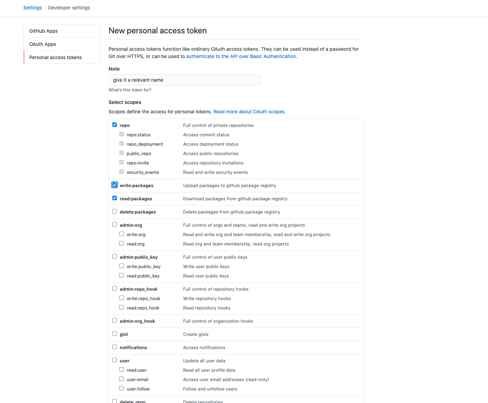

# LSARP API

## Prerequisites

- Python Version: 3.7 or higher
- Python Version Manager: pyenv
- Python Environments and Packages Manager: pipenv
- Database: PostgreSQL 
    - Make sure `LSARP_DATABASE_URL` is set and sourced in `~/.bash_profile, ~/.bashrc or ~/.zshrc` or similar. 

        Example:
            `LSARP_DATABASE_URL=postgresql://<username>:<password>@<host_or_domain>:<port_possibly_5432>`
- Execution tool: GNU Make (Make provides a unifying program execution interface. Unifying Docker, Python et al)
- Containerised platform: Docker and Docker compose (optional)
- Virtual Machine platform: Compute Canada's OpenStack Platform(s)
- Operating systems:
    - CentOS version 8 (production and development environment(s) via OpenStack VM or Docker only)
    - Ubuntu version 20.04 (development environment via Docker only)
    - MacOS X Catalina (development environment only)

### Credentials

- Active CCDB user(s) account
- IDP / Service provider [OIDC configurations](https://git.computecanada.ca/cc-middleware/idp-tap-config/-/tree/main/config/shib-idp/metadata).
- Github personal access token ([PAT](https://github.com/settings/tokens)).
    - Create a token giving it the following privileges:
        - repo (check all)
        - write:packages
        - read:packages
        - delete:packages (optional)
        
    - Copy and paste it to ~/LSARP_GITHUB_TOKEN.txt

## Viewing API's documentation

    Open http://localhost:3000/ on your browser to view swagger documentation

## Setting up development environment (optional)

Setup environment:

    $ make install

Initialize database (optional, only run on fresh install of PostgreSQL):

NB: Make sure `LSARP_DATABASE_URL` is set and sourced in `~/.bash_profile, ~/.bashrc or ~/.zshrc` or similar.

Example:
    `LSARP_DATABASE_URL=postgresql://<username>:<password>@<host_or_domain>:<port_possibly_5432>`

    $ make db init

Create database:

NB: Make sure `LSARP_DATABASE_URL` is set and sourced in `~/.bash_profile, ~/.bashrc or ~/.zshrc` or similar.

Example:
    `LSARP_DATABASE_URL=postgresql://<username>:<password>@<host_or_domain>:<port_possibly_5432>`

    $ make db create

Migrate database:

    $ make db migrate

Seed database (optional):

NB: Seeds don't working in production becuase `SEED_DATA_COUNT` is set to 0 and the seed cli command has been is exclusive to development and test environments

    $ make db seed

To run application in development mode:

    $ make server

To run tests: 

    $ make tests

## Working with Docker(optional)

Create development Docker container (default CentOS):

    $ docker-compose up

OR 

    $ LSARP_API_OS_PLATFORM=centos docker-compose up

Create development Docker container (Ubuntu):

    $ LSARP_API_OS_PLATFORM=ubuntu docker-compose up

Setup development Docker container:

Open another terminal window or tab and run the following:

    $ docker exec -it api-<os> /bin/bash # Example api-centos or api-ubuntu
    $ source $(pipenv --venv)/bin/activate (optional)
    $ make db create
    $ make db migrate
    $ make db seed (optional)
    $ make tests

### Packaging and publishing Docker images 

Build docker images (builds locally): 

    $ make build

Publish docker images (publishes exclusively to Github): 

    $ make publish

NB: The aforementioned uses the default `wgbot` team github user to publish. If this isn't desirable, do the following:

    $ GITHUB_USERNAME=<desired_github_username> make publish

NB: It is also important to point out that you also need to change the personal access token in ~/LSARP_GITHUB_TOKEN.txt to that of the <desired_github_username>.

## Running Tests

To run all the tests:

    $ make tests

To run a single the test file:

    $ make test <path/to/name_of_test_file>

Example:

    $ make test app/tests/test_projects.py

To run a single the test class:

    $ make test <path/to/name_of_test_file>::TestClass

Example:

    $ make test app/tests/test_projects.py::TestProjects

To run a single the test method:

    $ make test <path/to/name_of_test_file>::TestClass::test_method

Example:

    $ make test app/tests/test_projects.py::TestProjects::test_fetch_all_owned_and_collaborating_projects_without_page_and_per_page_and_direction

## Working with database

Make sure `LSARP_DATABASE_URL` is set and sourced in `~/.bash_profile, ~/.bashrc or ~/.zshrc` or similar. 

Example:
    `LSARP_DATABASE_URL=postgresql://<username>:<password>@<host_or_domain>:<port_possibly_5432>`

Initialize database (optional, only run on fresh install of PostgreSQL):

    $ make db init

Create database:

    $ make db create

Drop database:

    $ make db drop

Create database migration files:

    $ make db migration

Update Schema with database migrations:

    $ make db migrate

Seeding and generating sample data:

NB: By default you get a 100 rows of projects and data types and 2 MZXml and metadata shipments assigned to each data type/

    $ make db seed

NB: If you need more or less than 100 rows

    $ SEED_DATA_COUNT=<however_many> make db seed

## Debugging 

Access console in development environment with:

    $ make console dev

Access console in production environment with:

    $ make console

## Linting (i.e Static code analysis)

Check for stylistic errors and suspicious constructs:

    $ make lint

Format syntax to conform to Python ideals:

    $ make format

## Housekeeping

To clean project caches et al:

    $ make clean 

To perform a quick hands off DRY run on this project:

    $ make all 

## Production

To start a production version of this api:

    $ make start

### With Docker-compose 

For CentOS:

    $ LSARP_API_OS_PLATFORM=centos FLASK_ENV=production docker-compose up

For Ubuntu:

    $ LSARP_API_OS_PLATFORM=ubuntu FLASK_ENV=production docker-compose up
