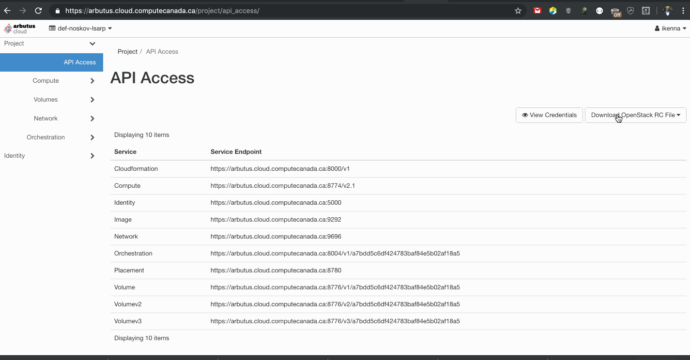

# Provisioning OpenStack VM

This readme is provides a guide for provisioning the admin side of resistance db.

## Prerequisites

- Virtual Machine platform: Compute Canada's OpenStack Platform(s)
- Operating systems:
    - Ubuntu version 20.04 (development environment via Docker only)
    - MacOS X Catalina (development environment only)
- OpenStack Virtual Machine Management Tool: 
  - Terraform 0.13.2 or higher
  - Ansible 2.9.11 or higher
- Environment variables: (Depending on the target platform (Example arbutus or cedar). Add to shell profile file and don't forget to source )

  - The following variables need to be set (in .bashrc or .zshrc etc):

    ```
    export OPEN_STACK_CLOUD=<set-relevant-value>
    export OPEN_STACK_AUTH_URL=<set-relevant-value>
    export OPEN_STACK_TENANT_ID=<set-relevant-value>
    export OPEN_STACK_TENANT_NAME=<set-relevant-value>
    export OPEN_STACK_REGION_NAME=<set-relevant-value>
    export CCDB_DOMAIN_USERNAME=<set-relevant-value>
    export CCDB_DOMAIN_PASSWORD=<set-relevant-value>
    export TF_VAR_floating_ip=<set-relevant-value>
    export TF_VAR_vm_ssh_key_pub=$(cat ~/.ssh/wg/vm/id_rsa.pub)
    export TF_VAR_vm_ssh_key_priv=$(cat ~/.ssh/wg/vm/id_rsa)
    export TF_VAR_dev_ssh_key=$(cat ~/.ssh/id_rsa.pub)
    export TF_VAR_dev_ssh_key_name=$(whoami)-ssh-key
    ```
  - CC_OS_CLOUD (Example: arbutus, cedar or rdb-on-arbutus or rdb-on-cedar)
  - CCDB_DOMAIN_USERNAME (Example: ccdb username.. Can use wgdev the teams pseudo ccdb user)
  - CCDB_DOMAIN_PASSWORD (Example: ccdb user password.. Can use wgdev password)
- Download API access credentials to `~/.config/openstack/clouds.yaml`



- Create ssh folder and files for holding VM SSH keys:

  ```
  mkdir ~/.ssh/wg/vm/
  touch ~/.ssh/wg/vm/id_rsa.pub
  touch ~/.ssh/wg/vm/id_rsa
  ```
- Setup the VM SSH keys from [here](https://git.computecanada.ca/snippets/29)
- Define OpenStack username and password to `~/.config/openstack/secrets.yaml`
    
    ```
      clouds:
        <cc_cloud_platform>:
          auth:
            username: <username>
            password: <password>
    ```

- Sourcing openrc before running `$ CC_OS_CLOUD=<cc_cloud_platform> source src/builds/vm/terraform/openrc`
- Initialize Terraform: `terraform init src/builds/terraform`
- View Terraform plan: `$ terraform plan src/builds/vm/terraform` or `$ terraform plan -var-file=path/to/terraform/config/<variables>.tfvars src/builds/vm/terraform`

### Credentials

- Active CCDB user(s) account
- IDP / Service provider [OIDC configurations](https://git.computecanada.ca/cc-middleware/idp-tap-config/-/tree/main/config/shib-idp/metadata).

## Create VM

By default this will create a Ubuntu VM on Arbutus.. Cedar is also possible. The rest can be made possible by overriding the variables from src/builds/vm/config/cedar.tfvars

### Create Ubuntu VM on Arbutus for production instance

	  $ terraform apply -var-file=src/builds/terraform/config/arbutus-production.tfvars src/builds/vm/terraform

### Create Ubuntu VM on Arbutus for staging instance

	  $ terraform apply -var-file=src/builds/terraform/config/arbutus-staging.tfvars src/builds/vm/terraform

### Create Ubuntu VM on Cedar for staging instance

	  $ terraform apply -var-file=src/builds/terraform/config/cedar.tfvars src/builds/vm/terraform

### Create Ubuntu VM on Arbutus for dev instance

	  $ terraform apply -var-file=src/builds/terraform/config/arbutus-dev.tfvars src/builds/vm/terraform

# Provisioning RDB VM

The choosen tool for provisioning this VM is Ansible. It provides YAML based scripts that assist with the instalation and setup of system components required for the smooth running of this website.

With Ansible one gets the added advantage of a definition of how the VM is setup. It strongly dicourage to manually make changes without updating these ansible scripts. This way one can track and gain an idea of the inner dwellings.

### Prerequisites

- To start [install](https://docs.ansible.com/ansible/latest/installation_guide/intro_installation.html) Ansible.

- Define the host IP Address globally in `/etc/ansible/hosts` 
  ```
    [resistancedb]
    <IP Address>
  ```

### Run Ansible

- Run playbook

  ```
    ansible-playbook src/builds/vm/playbook/main.yml
  ```

  - To run in debug mode 

    ```
     ANSIBLE_DEBUG=1 ansible-playbook src/builds/vm/playbook/main.yml -vvv
    ```
- Visit the url or floating IP or Domain.
